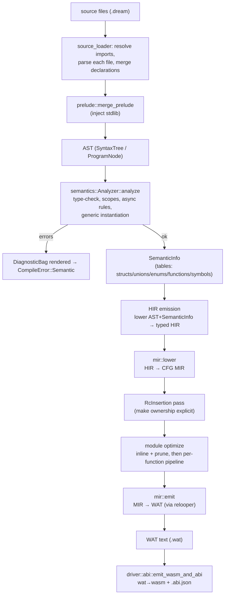
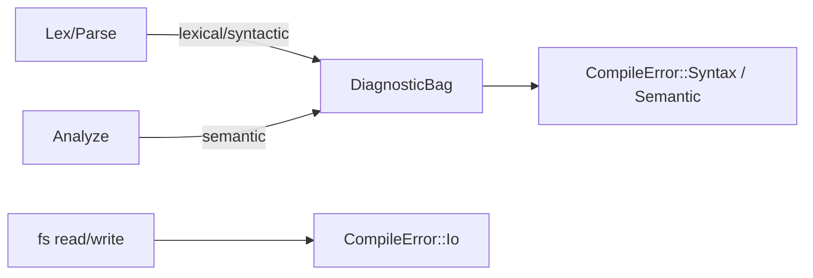

# 01 — Pipeline Overview

This chapter is the map. It walks the whole compilation pipeline stage by stage: what each stage consumes, what it produces, where it lives, and what it guarantees the next stage. Later chapters zoom into individual regions.

## End-to-end flow

The `hir → mir → emit` pipeline is the **only** backend.

## Stage by stage

### 1. Source loading — `src/driver/source_loader.rs`, `src/driver/prelude.rs`

- **In:** an entry file path.
- **Out:** one merged `ProgramNode` (all imported files' declarations plus the prelude).
- **Key types:** `ProgramAccumulator` collects `all_functions`, `all_structs`, `all_enums`, `all_extends`, `all_globals`, and `visited` (the cycle guard).
- **Guarantees:** import cycles are broken; every referenced module is parsed once.

### 2. Lexing & parsing — `crates/dream-syntax/`

- **In:** source text.
- **Out:** the AST. Entry points: `Lexer::new`, `Parser::new(...).parse()`.
- **AST shape:** `ProgramNode` → declarations (`FunctionNode`, `StructDeclarationNode`, `EnumDeclarationNode`, …); bodies are `StatementNode`/`ExpressionNode`; type annotations are the `Type` enum (`crates/dream-syntax/src/nodes/types.rs`).
- **Guarantees:** lexical/syntactic errors go into a `DiagnosticBag`. The AST is *faithful* to source — no desugaring beyond the parser's `for-each` index locals.

### 3. Semantic analysis — `src/semantics/analyzer/`

- **In:** the AST.
- **Out:** `SemanticInfo`, or a `CompileError::Semantic` after errors.
- **What it does:** name resolution, type checking, scope validation, `async`/`await` legality, overload selection, and **generic instantiation** (monomorphization discovery).
- **Tables it populates** (in `SemanticInfo`):
  - `StructTable` / `StructInfo` — field layout
  - `UnionTable` / `UnionInfo` — variant layout
  - `EnumTable` — `name → (member → i32)`
  - `FunctionTable` / `FunctionTableInfo` — signatures + overloads
  - symbol tables — per-scope `name → Type`
- **Type identity:** type *decisions* run on the interned type system — assignability and overload viability go through `crate::types::{assignable, overload_compatible}` on `TypeId`s, generic bindings carry structured `Type`s, and classification matches on AST variants / `TyKind` rather than comparing `get_type()` spellings. The instance-keyed tables are keyed by their monomorphized instance names, which double as the deterministic backend emit identity. User-facing diagnostics use `display_name` (`Box<int>`), never the mangled spelling.

### 4. Type system — `src/types/` (cross-cutting)

Not a pipeline "stage" but the shared vocabulary of stages 3–7. See [02-type-system.md](./02-type-system.md). The `TypeCtx` (interner + def table + lowering) is threaded through analysis and lowering.

### 5. HIR emission — `src/semantics/analyzer/hir_emit/`

- **In:** AST plus the facts the analyzer computed.
- **Out:** `Hir` — typed and name-resolved (see [03-hir.md](./03-hir.md)).
- **Why:** persist what `analyze_expression`/overload selection would otherwise discard, so the backend never re-derives types or resolutions.

### 6. MIR lowering & optimization — `src/mir/`

- **In:** HIR.
- **Out:** optimized MIR (a CFG per function).
- **Steps:** `mir::lower` desugars structured control flow into blocks; `RcInsertion` makes ownership explicit (module-wide, before inlining); `optimize_module` inlines and prunes, then the per-function `PassManager` runs the optimization pipeline to a fixpoint. See [04-mir.md](./04-mir.md) and [05-writing-passes.md](./05-writing-passes.md).

### 7. Backend — `src/mir/relooper.rs` + `src/mir/emit/`

- **In:** optimized MIR.
- **Out:** WAT text.
- **How:** the relooper recovers structured shapes from the CFG; `emit` walks the function and emits WAT, reusing the runtime/memory/object/string layers. See [06-relooper-and-backend.md](./06-relooper-and-backend.md).

### 8. Assembly emission — `src/driver/abi.rs`

- **In:** WAT text plus the AST root (for ABI metadata).
- **Out:** `.wat`, `.wasm`, and an `.abi.json` describing extern imports/exports for the JS runtime.

## Where errors come from

- User-facing problems are reported as **diagnostics** during lex/parse/analyze and surface as `CompileError::Syntax` / `CompileError::Semantic` (`CompileError::Io` wraps source/artifact I/O).
- The backend has **no user-facing error path**: it expects a fully validated program. A promised invariant it finds violated is a compiler bug (ICE) and `panic!`s rather than returning a diagnostic.
- The backend never runs on a program that produced any diagnostic error, so poison (`Error`-typed) values never reach lowering.

## Invariants the back end relies on

1. **Analysis succeeded.** No poison types, every name resolved, every call has a callee.
2. **Types are interned.** Equality is `TypeId == TypeId`; no string parsing of type names.
3. **Generics are resolved.** Every generic use is recorded as a concrete `(DefId, args)` instance.
4. **Control flow is reducible.** Dream's surface syntax cannot express irreducible CFGs, so the relooper always succeeds.
5. **Determinism.** Every map that influences emission preserves insertion order (`IndexMap`), so two compilations of the same input produce byte-identical output (guarded by the `codegen_is_deterministic` e2e test).
