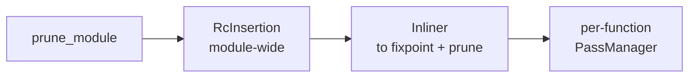

# 05 — Writing Optimization Passes (`src/mir/passes/`)

Read this when you want to **make the compiler produce better code**. It covers the pass infrastructure, the whole-module driver, the passes that ship today, and a step-by-step tutorial for adding your own. Passes operate on MIR — read [04-mir.md](./04-mir.md) first.

## Two contracts: `MirPass` and `ModulePass`

Most passes are **function-local** and implement `MirPass` (`src/mir/passes/mod.rs`):

```rust
pub trait MirPass {
    fn name(&self) -> &'static str;
    /// Transform one function. Return `true` iff anything changed.
    fn run(&self, func: &mut MirFunction, interner: &TypeInterner) -> bool;
}
```

A few passes need the **whole module** at once (inlining is the main one) and implement `ModulePass`:

```rust
pub trait ModulePass {
    fn name(&self) -> &'static str;
    fn run(&self, mir: &mut Mir, interner: &TypeInterner) -> bool;
}
```

Two rules make the system work:

1. **Scope honestly.** A `MirPass` sees one function; a `ModulePass` sees the module. Don't smuggle cross-function state into a `MirPass`.
2. **Report change honestly.** The return value drives a fixpoint loop, so returning `true` when nothing changed spins the loop (capped at `max_iterations = 16`), and returning `false` after a change means later passes miss the opportunity. Be precise.

## The whole-module driver

`optimize_module` (`src/mir/passes/mod.rs`) sequences the module-wide phases, and the order is **correctness-relevant**, not just an optimization choice:



- `prune_module` tree-shakes unreachable functions.
- `RcInsertion` runs **before** inlining. Dream has deterministic, reference-counted destruction, so a local reference's lifetime must end where its owning function returns. Inserting RC first bakes each callee's scope-exit `Release`s into its body, so inlining copies them to the return site and object lifetimes are preserved exactly. (A `debug_assert!` guards against a future reorder that would hoist the inliner above RC insertion.)
- `Inliner` runs to a fixpoint interleaved with pruning: each round may expose more inlining and more dead callees.
- The per-function `PassManager` then cleans up the merged bodies.

Debug-info builds call `optimize_module_opts(.., inline = false)`: RC insertion and pruning still run (they are correctness-relevant), but inlining is off so each user function keeps its own body and call frame for the debugger.

## The per-function pipeline

`PassManager` runs a configured list of `MirPass`es **repeatedly until none reports a change** (or the cap is hit). `PassManager::default_pipeline` is ordered so cheap simplifications expose work for the later ones:


The ordering principle: **cheap rewrites that expose more work run first.** Propagation turns `x = 1; y = x + 2` into `y = 1 + 2`, folding turns that into `y = 3`, which makes a branch constant, which SimplifyCfg folds, which makes a block unreachable, which DCE deletes — and the now-dead RC ops get elided. The fixpoint loop lets these cascade.

> `RcInsertion` is **not** in this pipeline — it runs once module-wide (above). The pipeline only contains `RcElision`, which removes pairs the other passes expose. `PassManager::debug_pipeline` is a minimal value-preserving pipeline (`SimplifyCfg` + `RcElision`) for debug-info builds.

## A tour of the shipped passes

Function-local `MirPass`es:

- **`CopyConstProp` (`prop.rs`)** — intra-block copy/constant propagation. Within a block, if `x = <const|local>` and `x` is not reassigned before a use, the use is rewritten to the source. Shrinks live ranges and feeds `ConstFold`.
- **`GlobalProp` (`global_prop.rs`)** — propagation across block boundaries.
- **`Sccp` (`sccp.rs`)** — sparse conditional constant propagation.
- **`ConstFold` (`const_fold.rs`)** — evaluates `Binary`/`Unary` rvalues whose operands are all `Const`. Integer ops use `wrapping_*`; division/modulo by zero is **left for the runtime to trap** (the fold returns `None`). The canonical "simplest pass" — read it first.
- **`Algebraic` (`algebraic.rs`)** — algebraic identities (`x + 0 → x`, `x * 1 → x`, `x * 0 → 0`, …).
- **`Gvn` (`gvn.rs`)** — global value numbering, removing redundant computation.
- **`Licm` (`licm.rs`)** — loop-invariant code motion.
- **`LoopUnroll` (`loop_unroll.rs`)** — unrolls small counted loops.
- **`Sroa` (`sroa.rs`)** — scalar replacement of aggregates.
- **`Dse` (`dse.rs`)** — dead store elimination.
- **`SimplifyCfg` (`simplify_cfg.rs`)** — folds `If{cond: Const(bool), ..}` into a `Goto` and threads jumps through empty blocks, exposing unreachable blocks for DCE.
- **`Tco` (`tco.rs`)** — tail-call optimization.
- **`Dce` (`dce.rs`)** — two kinds: drop blocks unreachable from `entry` (reachability over `Terminator::successors`), and remove assignments to never-read locals *when the rvalue is pure* (a `Call`/`New` may have side effects and must stay).
- **`RcElision` / `RcInsertion` (`rc.rs`)** — `RcInsertion` conservatively inserts `Retain`/`Release`; `RcElision` cancels adjacent cancelling pairs. Correctness rule: **never make a program under-retain.** When unsure, RcInsertion keeps the retain; RcElision only removes a pair it can prove is adjacent and cancelling.

The one shipped `ModulePass` is **`Inliner` (`inline/`)**.

## Tutorial: reconstruct the `Algebraic` pass

Dream already ships `Algebraic`; rebuilding a slice of it is the clearest way to see the full mechanics. Goal: rewrite `x + 0 → x`, `x * 1 → x`, `x * 0 → 0`.

### Step 1 — the pass file

`src/mir/passes/algebraic.rs`:

```rust
//! Algebraic identities: x+0, x-0, x*1, x*0, x/1.

use super::MirPass;
use crate::mir::{BinOp, Const, MirFunction, Operand, Rvalue, Statement};
use crate::types::TypeInterner;

pub struct Algebraic;

impl MirPass for Algebraic {
    fn name(&self) -> &'static str { "algebraic" }

    fn run(&self, func: &mut MirFunction, _interner: &TypeInterner) -> bool {
        let mut changed = false;
        for block in &mut func.blocks {
            for stmt in &mut block.stmts {
                if let Statement::Assign(_, rvalue) = stmt {
                    if let Some(simpler) = simplify(rvalue) {
                        *rvalue = simpler;
                        changed = true;
                    }
                }
            }
        }
        changed
    }
}

fn is_int(op: &Operand, n: i64) -> bool {
    matches!(op, Operand::Const(Const::Int(v)) if *v == n)
}

fn simplify(rvalue: &Rvalue) -> Option<Rvalue> {
    let Rvalue::Binary(op, a, b) = rvalue else { return None };
    match op {
        BinOp::Add if is_int(b, 0) => Some(Rvalue::Use(a.clone())),
        BinOp::Add if is_int(a, 0) => Some(Rvalue::Use(b.clone())),
        BinOp::Sub if is_int(b, 0) => Some(Rvalue::Use(a.clone())),
        BinOp::Mul if is_int(b, 1) => Some(Rvalue::Use(a.clone())),
        BinOp::Mul if is_int(a, 1) => Some(Rvalue::Use(b.clone())),
        BinOp::Mul if is_int(a, 0) || is_int(b, 0) => Some(Rvalue::Use(Operand::Const(Const::Int(0)))),
        _ => None,
    }
}
```

> **Side-effect caveat.** `x * 0 → 0` is only safe because MIR operands are *atomic* — all real computation has already been hoisted into prior statements, so dropping `x` drops a register read, never a side effect. A concrete payoff of MIR's "operands are atomic" invariant.

### Step 2 — register it

In `src/mir/passes/mod.rs`, add the `mod`/`pub use` lines and place it in the pipeline where it composes well — after `ConstFold` so folded constants feed it, and its output feeds folding on the next fixpoint iteration:

```rust
mod algebraic;
pub use algebraic::Algebraic;
// ... in default_pipeline(), between ConstFold and Gvn:
pm.add(ConstFold);
pm.add(Algebraic);
pm.add(Gvn);
```

### Step 3 — test it

Use `FunctionBuilder` (`src/mir/build.rs`) to construct a minimal function, run the pass, and assert on the result:

```rust
#[cfg(test)]
mod tests {
    use super::*;
    use crate::mir::build::FunctionBuilder;
    use crate::mir::{Operand, Place, Rvalue, Terminator};

    #[test]
    fn mul_by_one_is_identity() {
        let i = TypeInterner::new();
        let mut b = FunctionBuilder::new("f", i.int());
        let x = b.new_param(i.int());
        let t = b.new_temp(i.int());
        b.assign(
            Place::Local(t),
            Rvalue::Binary(BinOp::Mul, Operand::Copy(Place::Local(x)), Operand::Const(Const::Int(1))),
        );
        b.terminate(Terminator::Return(Some(Operand::Copy(Place::Local(t)))));
        let mut func = b.finish();
        assert!(Algebraic.run(&mut func, &i));
        assert!(matches!(&func.blocks[0].stmts[0], Statement::Assign(_, Rvalue::Use(Operand::Copy(_)))));
    }
}
```

### Step 4 — verify nothing regressed

```bash
cargo test -p dream mir::          # the MIR unit + integration tests
cargo test --workspace            # e2e + determinism
cargo clippy --workspace --all-targets -- -D warnings
```

## Checklist & pitfalls for any new pass

- [ ] `run` returns `true` **iff** it mutated the function. No false positives (infinite work), no false negatives (missed cascades).
- [ ] Iterate to a local fixpoint *within* `run` only if cheap; otherwise rely on the manager's loop.
- [ ] **Never drop a statement with side effects** to delete its result. Only pure `Rvalue`s (`Use`/`Binary`/`Unary`/`Cast`/`ArrayLen`) are removable; `Call`/`New`/`UnionNew`/`ArrayLit`/`IndirectCall` may allocate or trap.
- [ ] Respect RC balance: don't delete a `Retain`/`Release` unless you can prove the pairing.
- [ ] Use `Terminator::successors()` for CFG traversal; don't hand-match terminator variants for edges.
- [ ] Determinism: iterate blocks/stmts in `Vec` order; if you need a set/map, use `IndexMap`/`BTreeMap`, never `std::HashMap` (see [08](./08-testing-and-determinism.md)).
- [ ] Add a focused unit test with `FunctionBuilder` and keep the workspace green and clippy-clean.
