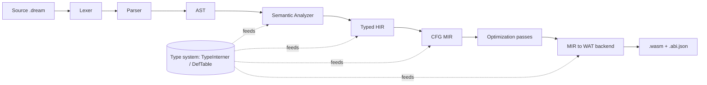
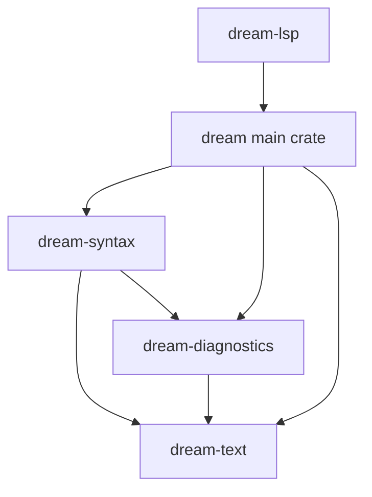

# Compiler Internals

This is the engineering handbook for the Dream compiler's middle and back end. It assumes you have never seen the codebase. By the end you should be able to add a language feature, write an optimization pass, extend the type system, or wire up a new backend without guessing.

Read the chapters in order the first time; afterward, use this page as an index.

| # | Chapter | Covers |
|---|---------|--------|
| — | This page | The big picture, repo layout, crate graph, glossary |
| 01 | [Pipeline Overview](./01-pipeline-overview.md) | Every compilation stage and the data that flows between them |
| 02 | [Type System](./02-type-system.md) | `TypeInterner`, `TypeId`, `TyKind`, `DefId`, compat rules; adding a type |
| 03 | [HIR](./03-hir.md) | The typed, name-resolved High-level IR |
| 04 | [MIR](./04-mir.md) | The CFG-based Mid-level IR and how HIR lowers into it |
| 05 | [Writing Passes](./05-writing-passes.md) | The pass manager and a step-by-step tutorial |
| 06 | [Relooper & Backend](./06-relooper-and-backend.md) | Recovering structured control flow and emitting WAT |
| 07 | [Adding a Feature](./07-adding-a-language-feature.md) | A worked example touching every stage |
| 08 | [Testing & Determinism](./08-testing-and-determinism.md) | How to test, the determinism contract, conventions |

## Why a multi-pass architecture

The original Dream backend walked the AST directly and re-derived semantic facts (types, resolved callees, ownership) inside code generation. That works for a small language but has three structural problems:

1. **Re-derivation is fragile and duplicated.** The analyzer already computes types and resolutions; an AST-walking backend recomputes approximations of them, and the two sources of truth drift apart.
2. **No place to optimize.** Constant folding, DCE, inlining, and refcount elision need a representation with explicit control and data flow. The AST has neither.
3. **Stringly-typed types.** Types compared and keyed as strings (`"Box_int"`, `"int[]"`, `"int?"`) make equality a string compare, monomorphization string mangling, and every consumer a re-parser. Slow, error-prone, hard to extend.

The current design fixes all three with three layered representations plus a structured type system:



Each arrow is a *total* lowering: the producer records everything the consumer needs, so the consumer never reaches backward. Types are interned once and referenced by a small integer (`TypeId`), so equality is `==` and there is no mangling.

## Repository layout (compiler-relevant)

```
Dream/
├── crates/                         Front-end crates (layered, enforced by the crate graph)
│   ├── dream-text/                 Source primitives: TextSpan, LineText, IndentedTextWriter
│   ├── dream-diagnostics/          DiagnosticBag, Severity, rendering
│   └── dream-syntax/               Lexer, parser, AST nodes (depends on text + diagnostics)
├── src/
│   ├── types/                      Structured type system (interner, DefTable, compat)
│   ├── hir/                        Typed High-level IR
│   ├── mir/                        CFG Mid-level IR, passes, relooper, WAT backend + runtime/ + abi.rs
│   ├── semantics/                  Semantic analyzer + its tables (HIR emission lives here)
│   ├── driver/                     Pipeline orchestration, source loading, errors
│   ├── stdlib/                     Prelude + host function registration
│   └── execution/                  (feature "native") wasmtime runner
└── docs/compiler/                  ← you are here
```

The `types → hir → mir` pipeline is the **only** backend. (An earlier AST-walking `codegen/` backend was replaced by it and deleted.)

### Crate dependency graph



The front-end crates are layered so `cargo` — not convention — enforces the dependency direction: `dream-syntax` can never reach into semantics or codegen. The main `dream` crate re-exports them (`pub use dream_syntax as syntax;`) so historical `crate::syntax::…` paths keep resolving.

## The three IRs at a glance

| | AST (`dream-syntax`) | HIR (`src/hir`) | MIR (`src/mir`) |
|---|---|---|---|
| **Shape** | Tree, mirrors source | Tree, type-checked | CFG of basic blocks |
| **Types** | Syntactic (`Type` enum) | `TypeId` on every node | `TypeId` on every local |
| **Names** | Identifiers | Resolved `Binding`/`Callee` | `Local`/`Global` indices |
| **Control flow** | `if`/`while`/`for`/… | Same (structured) | `goto`/`if`/`switch` terminators |
| **Generics** | Type-parameter syntax | Explicit `MonoInstance` worklist | Already monomorphized |
| **RC / alloc** | Implicit | Implicit | Explicit `Retain`/`Release`/`New` |
| **Purpose** | Faithful parse | Kill re-derivation | Optimize + emit |

## Glossary

- **Interning / hash-consing** — storing each distinct value once and handing out a small id. The `TypeInterner` interns types, so identical types share a `TypeId` and equality is integer equality.
- **`TypeId`** — an interned type handle (a `u32` newtype). Compare with `==`.
- **`DefId`** — a handle to a *nominal declaration* (struct/union/enum/function), independent of type arguments. `Box<int>` and `Box<string>` share one `DefId`.
- **Monomorphization** — generating a concrete copy of a generic per type-argument set. Keyed by `(DefId, Vec<TypeId>)`, never a mangled string.
- **Basic block** — a straight-line run of statements ending in exactly one terminator (the only place control branches).
- **Terminator** — the control-flow instruction ending a block (`goto`, `if`, `switch`, `return`, `unreachable`).
- **Operand** — a readable value: a local/global read or a constant. All computation is an `Rvalue`.
- **Relooper** — the algorithm that turns a reducible CFG back into the structured `block`/`loop`/`if` WASM requires.
- **RC** — reference counting. Heap values carry a count; `Retain` increments, `Release` decrements and frees at zero.
- **Poison / `Error` type** — the type given to expressions after a semantic error, assignable to and from everything so one mistake doesn't cascade into a flood of diagnostics.

## Doc conventions

- File references look like `src/mir/lower/mod.rs` and, where useful, name the function.
- Mermaid diagrams are used for graphs and flows; read them top-to-bottom / left-to-right.
