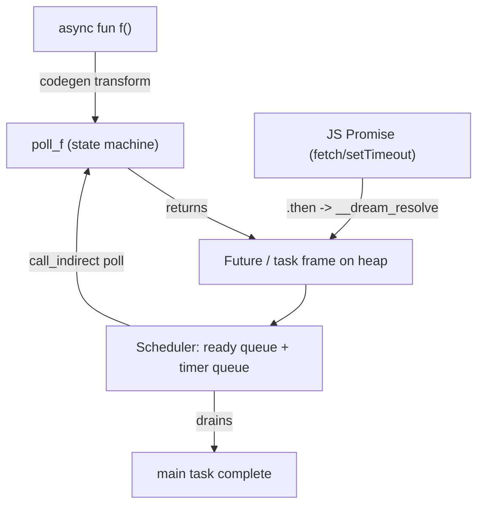

# Async / Await

Dream has cooperative concurrency with `async`/`await`. The execution model is **eager**, like JavaScript: calling an `async fun` starts the work immediately and hands you a `Future<T>` handle; `await` retrieves the result.

## Declaring and awaiting

Prefix a function with `async`. Its declared return type `T` becomes `Future<T>` at the call site. `await e` suspends the current task until `e`'s future resolves, then yields its value:

```dream
async fun fetchData(): string {
    await Time.sleep(100);   // suspends this task; the event loop keeps running
    return "data";
}

async fun main(): void {
    let x = await fetchData();   // x : string
    println(x);
}
```

`await f()` is just the call composed with `await`: `f()` produces a `Future<T>`, and `await` suspends on it to get `T`. The only rule is that `await` outside an `async` function is an error.

### Where `await` is allowed

The whole body of an `async` function compiles to a state machine, so `await` may appear in any expression or statement position — including conditionally-evaluated ones:

```dream
let x = await e;                // bind the result
let y = await f() + 1;          // in an operand
process(await a(), await b());  // several awaits in call arguments

if (retry) { data = await fetch(url); }         // in a branch
while (i < n) { sum += await g(i); i += 1; }    // suspends each iteration
let y = cond ? await a() : await b();           // in a ternary arm
let z = flag && await ready();                  // right side of && / || / ??
```

## Running work concurrently

Because calls are eager, you can start several before the first `await` and let them run concurrently, then combine them:

```dream
async fun work(id: int): int {
    await Time.sleep(50);
    return id * id;
}

async fun main(): void {
    let a = work(2);                         // started now
    let b = work(3);                         // started now
    let results = await Promise.all([a, b]); // both ran concurrently -> [4, 9]
    System.println(results[0] + ", " + results[1]);
}
```

### Combinators (`Promise`)

Static methods on the built-in `Promise` class, over `Future<T>[]`:

| Method | Signature | Resolves when |
| --- | --- | --- |
| `Promise.all` | `Promise.all(xs: Future<T>[]): Future<T[]>` | every future has resolved (results in order) |
| `Promise.any` | `Promise.any(xs: Future<T>[]): Future<T>` | the first future resolves |
| `Promise.race` | `Promise.race(xs: Future<T>[]): Future<T>` | the first future settles |

```dream
let first = await Promise.any([work(10), work(20)]);
```

`Time.sleep(ms: int): Future<void>` is an awaitable timer backed by the runtime's timer queue (a virtual clock natively, `setTimeout` in the browser). It composes with the combinators like any other future.

## Async methods

Instance and `static` class methods can be `async`, so a type can own its asynchronous behavior. The call types as `Future<T>` just like a free async call:

```dream
class Downloader {
    url: string;
    async fun fetch(): string {
        let body = await HttpClient("").text(this.url);
        return body;
    }
}

async fun main(): void {
    let d = Downloader("https://example.com");
    let body = await d.fetch();   // d.fetch() : Future<string>
    println(body);
}
```

Async methods work on **generic** classes too: each instantiation is monomorphized to its own concrete async state machine.

## Advanced

### How it works

Each `async fun` compiles to a resumable **state machine** plus a heap **task frame** (the `Future`). A small cooperative **scheduler** — a ready queue plus a timer queue — drives the polls. Calling an `async fun` allocates the `Future` and enqueues its first poll; `await` registers the current task as a waker on the awaited future and suspends until it resolves.



The whole event loop lives **inside** the WebAssembly module, so an async program is self-driving and deterministic. An async `main` is exported as an ordinary `() -> ()` entry point that spawns the top-level task and pumps the loop to completion — nothing extra is needed to run it under `wasmtime`.

### Awaiting JavaScript promises

An `extern async fun` bridges to a host function returning a `Promise`. The `.then` wiring lives entirely in `dream.js`; Dream source never sees a promise:

```dream
@js("api", "getUser")
extern async fun getUser(id: int): string;

async fun main(): void {
    let name = await getUser(42);   // suspends until the JS promise resolves
    println("user = " + name);
}
```

```js
import { run } from "./dream.js";

await run("user.wasm", {
  imports: {
    // Returning a Promise is enough — dream.js allocates a host Future,
    // hands its pointer back to Dream, and resolves it when the Promise settles.
    getUser: (id) => fetch(`/api/user/${id}`).then((r) => r.text()),
  },
});
```

The generated `*.abi.json` marks async externs with `"async": true` so the runtime treats the import result as a `Promise`. A complete runnable example lives in [`sample/interop/async_fetch.dream`](https://github.com/sps014/Dream/blob/main/sample/interop/async_fetch.dream).

## Limitations (v1)

- No `.then()`/callback chaining. `async`/`await` is a single-threaded cooperative scheduler: tasks interleave at `await` points but run on one thread. For real parallelism across threads (separate memory, message passing), see [WebWorkers](webworkers.md).
