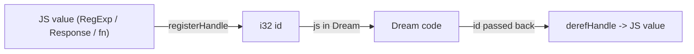

# The dynamic `js` type

`js` is a dynamic JavaScript-interop type: an opaque handle to a live JavaScript value held by the
runtime. A real JS object (a DOM node, a `Response`, a `RegExp`, a function) crosses into Dream as a
`js` value and is read, called, and mutated with **native syntax** - `doc.getElementById("app")`,
`el.title = "x"`, `cb("done")` - instead of being flattened to a string or driven through fixed-arity
helpers.

## Deferred binding

`js` behaves like C# `dynamic` / TypeScript `any`: it is a static type, but the compiler performs
**no member resolution** on it. Any `.name`, `.name(...)`, `[...]`, or call on a `js` value is legal
by construction and lowered to a runtime bridge; whether the member actually exists is decided at
runtime by the JS host (it returns `undefined` or throws, surfaced through the runtime). Every `js`
operation yields another `js`, so chains type-check trivially. You only re-enter the static world at
a **typed boundary**, which triggers an automatic unbox.

## How it works

A `js` value is an `i32` id into a host-side handle registry. When an interop bridge returns a JS
value, the runtime registers it and returns the id; when an id is passed back, the runtime looks the
value up. A `js` value is not a Dream heap object, so it is never reference-counted: Dream will not
free it for you.



!!! warning "Release long-lived handles"
    Call `.release()` when you are done with a long-lived handle to drop the host-side entry and avoid leaking it.

## Getting a `js` value

The prelude provides entry points on `js`:

| Entry point | Description |
| --- | --- |
| `js.global(name): js` | a handle to `globalThis[name]` (e.g. `js.global("document")`) |
| `js.object(): js` | a fresh empty JS object `{}` to populate and hand to a JS API |
| `js.array(): js` | a fresh empty JS array `[]` |
| `js.func(fun(js): void): js` / `js.func0(fun(): void): js` | wrap a Dream function as a JS callable (usually implicit - see [Callbacks](callbacks.md)) |

```dream
fun main(): void {
    let doc = js.global("document");
    let el = doc.getElementById("app");     // dynamic method call, any arity
    el.textContent = "hello";               // property set (string auto-marshals)
    el.classList.add("a", "b", "c");        // chained, 3 args, one boundary crossing

    let n: int = el.childNodes.length;      // js -> int at the typed binding
    println("children: " + n);
}
```

## Marshaling

Arguments to a dynamic call auto-marshal:

- `string`, `int`/`long`/`double`/`bool` box into a `js` handle automatically.
- another `js` passes through as its handle.
- a Dream `fun` becomes a JS callable (see [Callbacks](callbacks.md)).
- a `struct` / `class` / `union` / `List<T>` is a **compile error** - build a JS value explicitly
  with `js.object()` / `js.array()` and set members natively (no silent deep copy).

Coming back, a `js` result stays `js`. It unboxes to a primitive/`string` automatically at a typed
binding, argument, or return; elsewhere use the explicit helpers:

| Method | Description |
| --- | --- |
| `to_int(): int` / `to_double(): double` / `to_bool(): bool` / `to_str(): string` | unbox to a Dream primitive |
| `is_null(): bool` | true if the value is `null` or `undefined` |
| `release(): void` | drop the host-side handle |

```dream
let opts = js.object();
opts.method = "POST";
opts.keepalive = true;
js.global("fetch")("/api", opts);          // call a js value directly
```

## Where it runs

`js` relies on the `Dream` host module in `runtime/dream.js`, so it only works under the JS runtime
(browser or Node), not the standalone `wasmtime` test harness (where the interop imports are stubbed
as traps). A runnable example lives in
[`sample/interop/js.dream`](https://github.com/sps014/Dream/blob/main/sample/interop/js.dream) with
its Node runner `js.mjs`.
