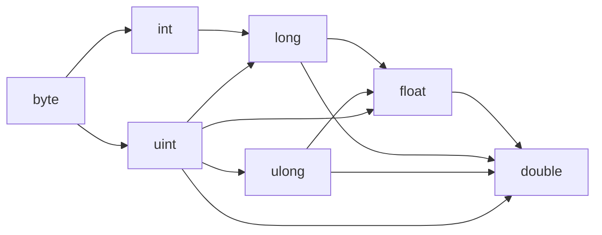

# Types

Dream is statically typed: every value has a type known at compile time. This page is the map of the type system — primitives, arrays, nullables, user types, aliases, and casting. Each area links to a deeper page.

## Primitives

| Type | Description | Example literal |
|------|-------------|-----------------|
| `int` | 32-bit signed integer | `42`, `-7` |
| `uint` | 32-bit unsigned integer | `42u`, `42U` |
| `long` | 64-bit signed integer | `42L` |
| `ulong` | 64-bit unsigned integer | `42uL`, `42UL`, `42Lu` |
| `byte` | 8-bit unsigned integer (0–255) | `255b`, `255B` |
| `float` | 32-bit floating point | `3.14f`, `1.0` |
| `double` | 64-bit floating point | `3.14d`, `1.0d` |
| `bool` | `true` or `false` | `true` |
| `char` | A single character (code point) | `'A'`, `'\n'` |
| `string` | UTF-8 text, heap allocated | `"hello"`, `$"hi {name}"` |
| `void` | No value — only valid as a return type | — |

See [Primitives](primitives.md) for the methods each one carries.

### Numeric literal suffixes

A plain integer literal is `int`; a literal with a decimal point is `float`. A case-insensitive suffix picks another numeric type:

| Suffix | Type | Example |
|--------|------|---------|
| `L` | `long` | `9000000000L` |
| `u` / `U` | `uint` | `4000000000u` |
| `uL` / `UL` / `Lu` | `ulong` | `18000000000uL` |
| `b` / `B` | `byte` | `255b` |
| `f` / `F` | `float` | `3.14f` |
| `d` / `D` | `double` | `3.0d` |

`byte`, `uint`, and `ulong` are **unsigned** — division, remainder, comparisons, and right shift use unsigned semantics; `int` and `long` are signed. In memory, `byte`/`char` take 1 byte, `int`/`uint`/`float` take 4, and `long`/`ulong`/`double` take 8.

### Implicit widening

A narrower numeric value promotes to a wider type automatically. Narrowing — and switching signedness at the same width (`int`↔`uint`, `long`↔`ulong`) — always needs an explicit cast.



```dream
let a: long = 5;              // int -> long
let b: ulong = 7u;            // uint -> ulong
let d: double = 9000000000L;  // long -> double
let n: int = (int)d;          // narrowing: cast required
```

## Arrays

Append `[]` to any type. Arrays are fixed-size, zero-indexed reference types:

```dream
let nums: int[] = [10, 20, 30];
let first = nums[0];   // 10
nums[1] = 99;
```

For a growable sequence, use [`List<T>`](../stdlib/collections.md) or `Array<T>`. See [Arrays](arrays.md) for the full story.

## Nullable types

Any reference type can be made nullable with `?`, letting it hold a value or `null`:

```dream
let node: Node? = null;
node = Node(5, null);
```

Primitives cannot be nullable. Use `??` to supply a fallback (see [Operators](operators.md)).

## User-defined types

- **Classes** — reference types with methods. See [Classes & Structs](classes-structs.md).
- **Value structs** — value types stored inline, copied on assignment, otherwise like classes. See [Classes & Structs](classes-structs.md).
- **Enums and unions** — named integer constants, or discriminated unions when variants carry payloads. See [Enums & Unions](enums-unions.md).
- **The `object` type** — a universal container that holds any value at runtime. See [The object type](objects.md).

## Type aliases

`type` names an existing type. Aliases resolve at compile time (fully interchangeable with the underlying type) and must be declared before use:

```dream
type Number = int;
type Names = string[];

fun add(a: Number, b: Number): Number {
    return a + b;
}
```

## Type casting

A C-style cast converts between numeric types or between a value and `object`:

```dream
let n = 7;
let f = (float)n;        // int -> float
let back = (int)f;       // float -> int

let o: object = n;       // boxing
let unboxed = (int)o;    // unboxing — traps if the runtime type is wrong
```

Supported: any numeric type ↔ any numeric type, `char ↔ int`, `char ↔ byte`, and any type ↔ `object`. Widening is implicit; narrowing and same-width sign changes need a cast. Casting into `byte` keeps only the low 8 bits.

The cast target may be a generic type, including nested arguments — `(Container<int>)b` or `(Pair<Box<int>, int>)b`. This is how you upcast to a generic interface (see [Interfaces](interfaces.md#generic-interfaces)).
